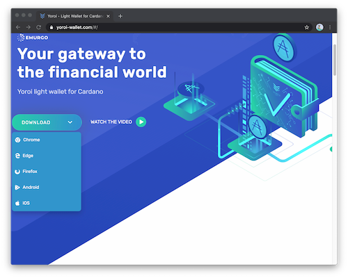
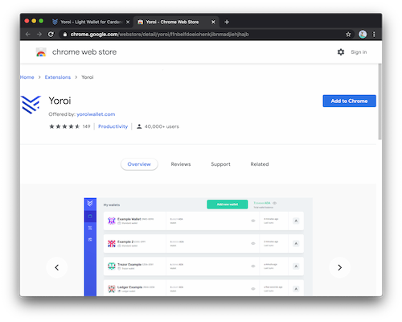
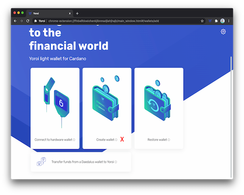
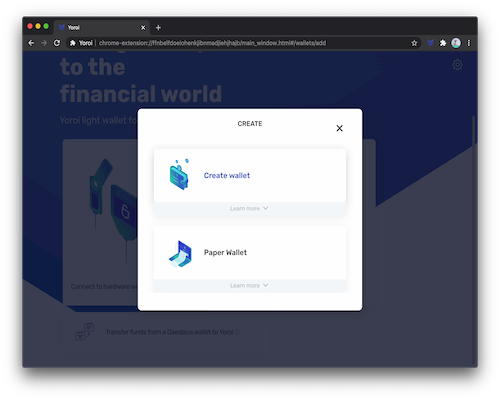
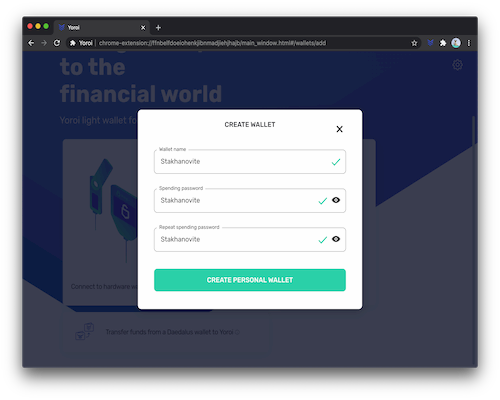
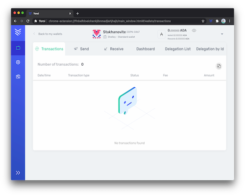
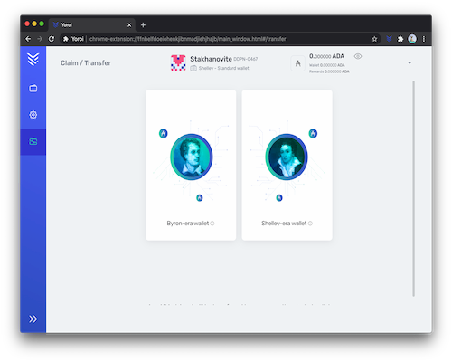
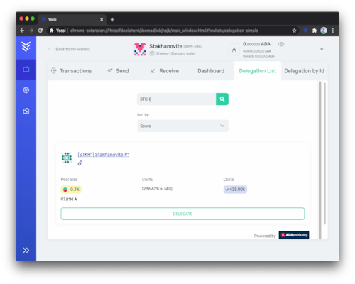

## How to delegate using Yoroi?

### Install Yoroi

Go to www.yoroi-wallet.com and choose the version you need.

In the following example, we have chosen the Google Chrome version. This takes us back to the Chrome Web Store to add the Yoroi extension to our browser.

Once the installation is complete, the Yoroi icon should appear in the top right corner of your browser window. Click on it, and it will open the application as follows. Choose your language. ***Please note that Stakhanovite has translated Yoroi into French.***

Accept the terms and conditions, and then choose the interface you want. Simple or Advanced. Once these steps have been completed, you will now be able to create your wallet.

### Create a wallet

Note that from Yoroi v3.2.2, any new wallet you create is compatible with delegation. It is called a "Shelley Wallet".

Choose the Cardano blockchain (Yoroi will soon be compatible with other crypto-currencies!).

Finally, create a wallet. The paper wallet option does not give you access to delegation for the moment.

Enter a name for your Wallet, as well as an spending password. You will be asked for this password for all future transactions.

The following steps will give you access to the mnemonic phrase. **Write down all the words you are given in order and on a piece of paper. Keep this handwritten document safe and secure**. If you lose these words, you could lose all your ADAs without any recourse.

Finally you land on the home page of your wallet. It will now appear every time you open your browser and click on the Yoroi icon.

### ADA recovery from an old wallet (Byron-era) or Shelley ITN testnet rewards

You have created a wallet compatible with Shelley but it is empty. If you had ADA before switching to Shelley or if you participated in the Shelley ITN, it's time to get it all back!

Click on the icon that looks like a "wallet with arrows" at the bottom left corner of the interface.

**Option 1 :** Your ada were on a classic Yoroi or Daedalus wallet, choose the Byron-Era option and select the type of wallet you want to recover from.

**Option 2 :** If you wish to recover ada rewards of a delegation that occurred during the Shelley ITN testnet, choose the Shelley-Era option and select the type of wallet you used to delegate from during the ITN.

**Important note:** Recovering those rewards from the ITN into a Shelley wallet is only possible if the Shelley wallet contains at least 1 ada to pay for the transaction fee. This can be newly purchased ada on an exchange, or ada recovered from a Byron-Era wallet (Option 1 above).

### Delegate to a Stake Pool (for example STKH!)

On the dashboard page of your wallet, choose the wallet you wish to delegate from (if you have created several wallets).

Click on the *Delegation List* tab and enter the name or the ticker of the stake pool you want to delegate to, for example here: STKH

The pool will appear and you now have to click on the *delegate* button. That's it. All done.

The first delegation costs a little over  2.17 ada. Two ada are a deposit (and will be returned to you on the day you unsubscribe your address) while 0.17 are consumed as transaction fees.
