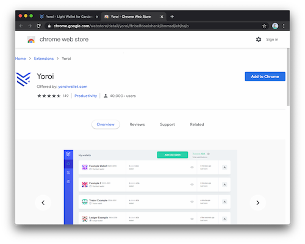
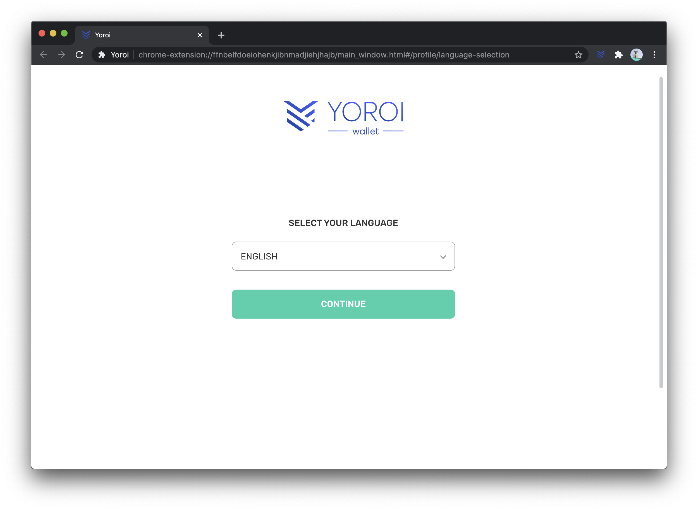
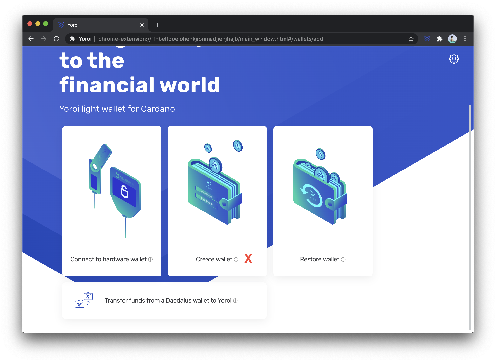
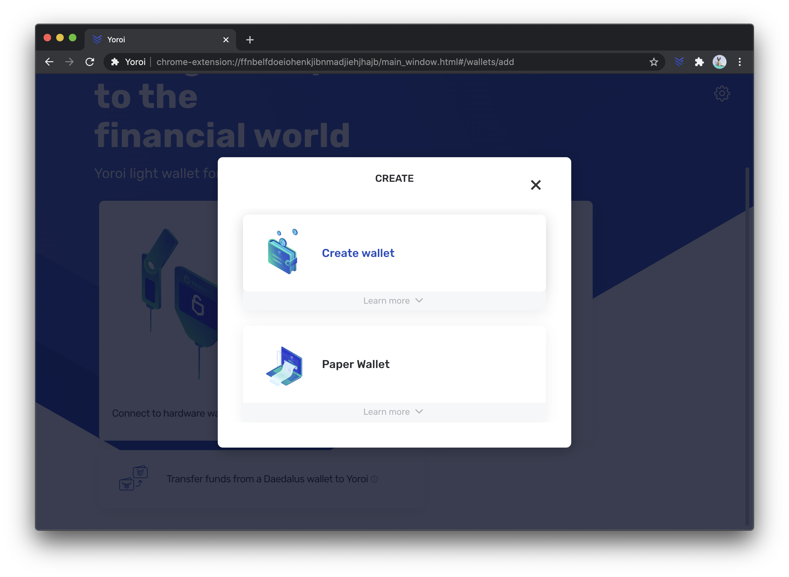
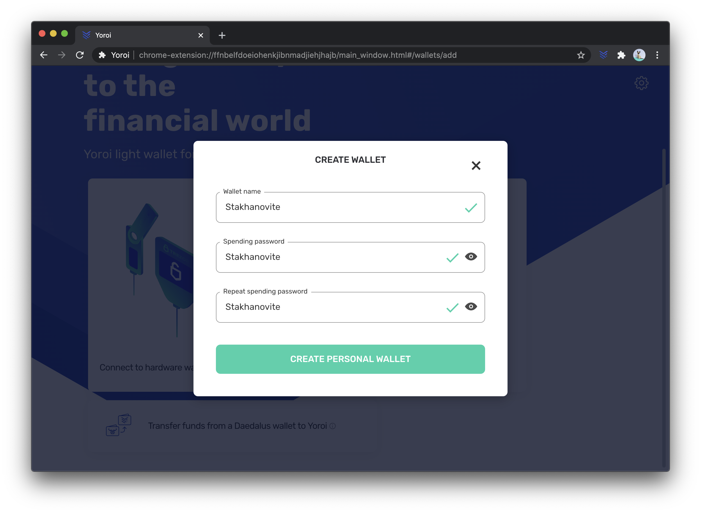
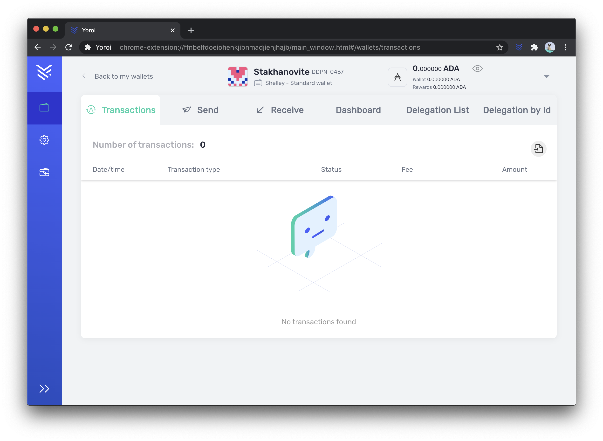
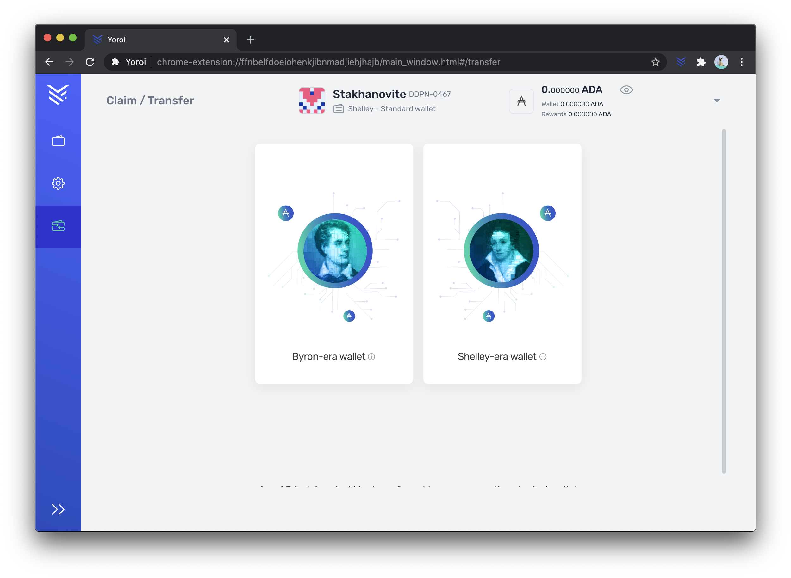

## Comment déléguer avec Yoroi - Le guide

#### Installation de Yoroi.

Rendez-vous sur www.yoroi-wallet.com et choisissez la version de Yoroi qui vous convient.

Dans l'exemple qui suit, nous avons choisi la version Google Chrome. Cela nous renvoie donc vers le Chrome Web Store afin d'ajouter l'extension Yoroi à notre navigateur.

 <!-- .element height="25%" width="15%" -->

Une fois l'installation effectuée, l'icône de Yoroi devrait apparaitre en haut à droite de la fenêtre de votre navigateur. Cliquez dessus, et cela vous ouvrira l'application comme suit. Choississez votre langue. ***Notez que Stakhanovite a traduit Yoroi en Français.***

 <!-- .element height="25%" width="15%" -->

Acceptez les termes et conditions, et choisissez ensuite l'interface que vous souhaitez. Simple ou Avancée. Une fois ces étapes passées, vous allez pouvoir maintenant créer votre wallet.

 <!-- .element height="25%" width="15%" -->

Notez qu'à partir de la version 3.2.2 de Yoroi, tout nouveau wallet que vous créez est compatible avec la délégation. On parle de "Wallet Shelley".

Choisissez la blockchain Cardano (Yoroi sera bientôt compatible avec d'autres cryptomonnaies !)

Enfin, créez un wallet. L'option Wallet Papier ne donne pas accès à la délégation pour le moment.

 <!-- .element height="25%" width="15%" -->

Entrez un nom pour votre Wallet, ainsi qu'un mot de passe de dépense. Ce dernier vous sera demandé pour toute opération future.

 <!-- .element height="25%" width="15%" -->

Les étapes qui suivent vont vous donner accès à la phrase de secours, aussi appelée phrase mnémonique. **Notez bien dans l'ordre et sur un papier tous les mots qui vous seront donnés. Gardez ce document manuscrit bien en sécurité**. Si vous perdez ces mots, vous pourriez perdre tous vos ADA et sans recours possible.

Enfin vous arrivez sur la page d'accueil de votre wallet. Elle apparaitra désormais à chaque fois que vous ouvrirez votre navigateur et cliquerez sur l'icône de Yoroi.

 <!-- .element height="25%" width="15%" -->

#### Récupérer ses ADA d'un ancien wallet ou les récompenses du testnet Shelley ITN

Vous avez crée un wallet compatible Shelley mais il est vide. Si vous disposiez d'ADA avant le passage à Shelley ou si vous avez participé au Shelley ITN, il est temps de récupérer tout ça !

Cliquez sur l'icône en forme de "portefeuille à flèches" en bas à gauche de l'interface

 <!-- .element height="25%" width="15%" -->

1) **Vos ADA étaient sur un wallet Yoroi ou Daedalus classiques, choisissez l'option Byron-Era et sélectionnez le type de wallet que vous voulez récupérer**

2) **Les ADA que vous souhaitez récupérer sont les récompenses d'une délégation pendant le testnet Shelley ITN, choisissez l'option Shelley-Era  et sélectionnez le type de wallet que vous voulez récupérer**

    Notez : récupérer les récompenses du testnet ITN vers un wallet Shelley n'est possible que si ce dernier contient au moins 1 ADA pour payer les frais de cette transaction. Cela peut être des ADA nouvellement achetés sur un échange, ou des ADA récupérés d'un wallet Byron-Era (etape 1 ci-dessus).

#### Déléguer sur un Stake Pool (STKH par exemple...)

Sur la page centrale de votre wallet, choisisser le wallet que vous souhaitez mettre en délégation (si vous en avez crée plusieurs ... )

Cliquez sur l'onglet *Delegation List* et rentrez le nom ou le diminutif du stake pool auquel vous voulez déléguer, par exemple ici : STKH

Le pool va apparaitre et il vous suffit alors de cliquer sur le bouton *delegate*. 

 <!-- .element height="25%" width="15%" -->

La première délégation coûte un peu plus de 2.17 ADA. 2 ADA sont en dépôt (et vous serons rendu le jour ou désinscrirez votre adresse) tandis que 0.17 sont consommés au titre des frais de transaction.
