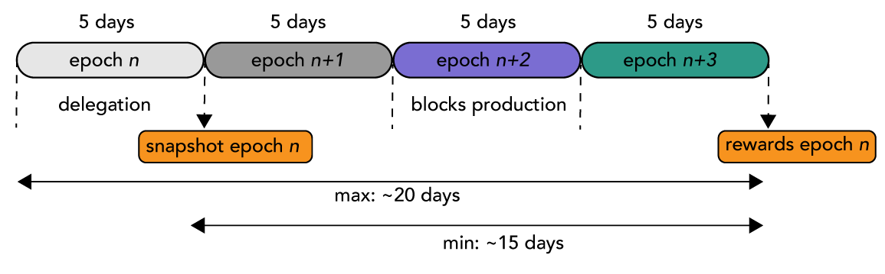

## Quand sont payées les récompenses ?

Le temps chez Cardano est divisé en époques de 5 jours. Si vous déléguez à l'époque *n*, vous recevrez les récompenses liées à cette époque à la fin de l'époque *n+3* (début de l'époque *n+4*). **En terme pratiques, cela veut dire que le délai sera au minimum de 15 jours et au maximum de 20 jours**, tout dépend de la date à laquelle vous déléguez dans l'époque *n* (début ou fin). Voir figure ci-dessus.

Après ce délai initial, vous recevrez vos récompenses tous les 5 jours puisqu'un "snapshot" de votre délégation continue d'être pris à la fin de chaque époque.

## Dois-je re-déléguer mes récompenses à la fin de chaque époque ?

Non. La délégation concerne le portefeuille (wallet) entier et  tous les ada qu'il contient, qu'ils proviennent des UTXO classiques ou des récompenses dans la partie "compte". De la même manière, si vous envoyez des ada vers votre wallet après un achat sur une plateforme d'échange, ces derniers seront délégués automatiquement dès le prochain "snapshot" de fin d'époque.

## Dois-je faire confiance au pool pour le paiement des récompenses ?

Non. Le protocole se charge de redistribuer les récompenses en proportion de votre enjeu délégué. Si votre enjeu représente 30% de l'enjeu total du groupe, alors il vous sera distribué 30% des récompenses obtenues par le groupe d'enjeu **après prélèvement des frais de participation au groupe** (fixe et marge).

**Le groupe d'enjeu n'a aucun contrôle sur le versement des récompenses et ne pourra donc jamais l'empêcher**

## Je ne reçois aucune récompenses...

Il faut tout d'abord vérifier à quelle date vous êtes éligible pour recevoir vos récompenses (voir figure ci-dessus). Enfin, vérifiez si le groupe d'enjeu auquel vous déléguez fonctionne correctement. Il se peut que l'enjeu total du groupe soit encore trop faible pour que ce dernier produise des blocs de manière régulière. Si vous avez des doutes, vous pouvez **contacter le groupe d'enjeu par e-mail si l'option est disponible**. Il s'agit là d'un critère important : pouvez vous communiquez facilement aves les opérateurs du pool ?

**N'oubliez pas : vous pouvez toujours re-déléguer vos ada sur un autre groupe d'enjeu quand vous le souhaitez !**
